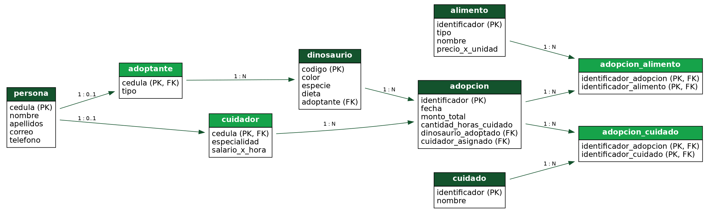
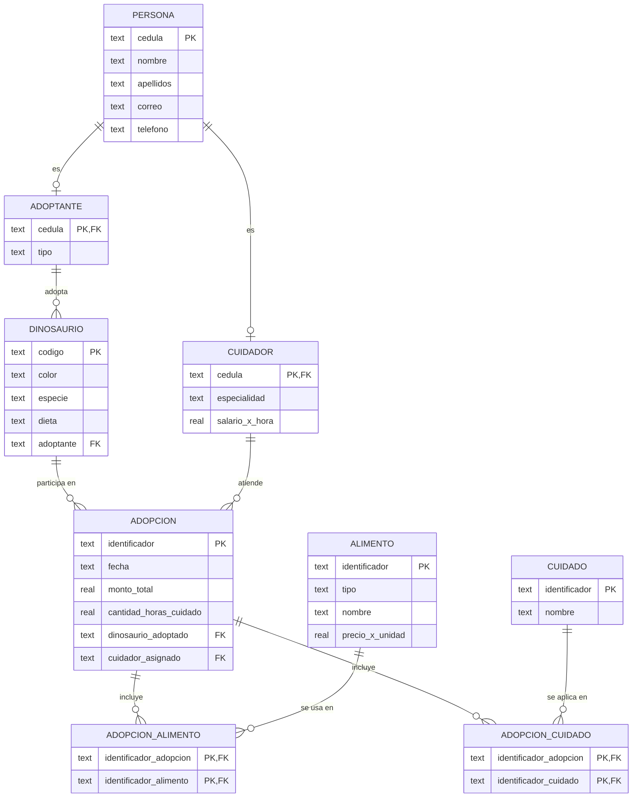

# Diagrama entidad-relación

Versión en Mermaid (se dibuja automáticamente en GitHub):

```mermaid
erDiagram
    PERSONA ||--o| ADOPTANTE : "es"
    PERSONA ||--o| CUIDADOR : "es"
    ADOPTANTE ||--o{ DINOSAURIO : "adopta"
    DINOSAURIO ||--o{ ADOPCION : "participa en"
    CUIDADOR ||--o{ ADOPCION : "atiende"
    ADOPCION ||--o{ ADOPCION_ALIMENTO : "incluye"
    ALIMENTO ||--o{ ADOPCION_ALIMENTO : "se usa en"
    ADOPCION ||--o{ ADOPCION_CUIDADO : "incluye"
    CUIDADO ||--o{ ADOPCION_CUIDADO : "se aplica en"

    PERSONA { text cedula PK  text nombre  text apellidos  text correo  text telefono }
    ADOPTANTE { text cedula PK,FK  text tipo }
    CUIDADOR { text cedula PK,FK  text especialidad  real salario_x_hora }
    ALIMENTO { text identificador PK  text tipo  text nombre  real precio_x_unidad }
    CUIDADO { text identificador PK  text nombre }
    DINOSAURIO { text codigo PK  text color  text especie  text dieta  text adoptante FK }
    ADOPCION { text identificador PK  text fecha  real monto_total  real cantidad_horas_cuidado  text dinosaurio_adoptado FK  text cuidador_asignado FK }
    ADOPCION_ALIMENTO { text identificador_adopcion PK,FK  text identificador_alimento PK,FK }
    ADOPCION_CUIDADO { text identificador_adopcion PK,FK  text identificador_cuidado PK,FK }
```
